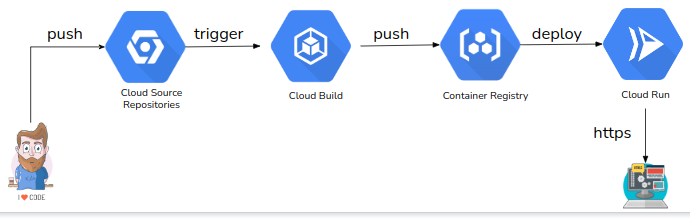

# - Comentários

Construi o projeto dessa maneira, pois por se tratar de um teste achei interessante demontrar como fazemos para criar uma solução utilizando várias ferramentas. Mesmo sabendo que existem diversas outras formas mais simples e atual, acreditando que desse jeito eu tenha conseguido passar para o avaliador, meus conhecimentos dessas ferramentas.

Eu poderia ter criado um contêiner Docker e ter realizado o deploy em um recurso ECS ou EKS da AWS, ou até mesmo utilizar recursos de outros provedores cloud como por exemplo, o Google Cloud. Para esse provedor, eu poderia ter criado um projeto utilizando todos os recursos nativos do mesmo, conforme a arquitetura abaixo:

 

Para isso, eu não precisaria de Terraform e do Gitlab e sim apenas, escrever todos os meus recursos em um único arquivo ***cloudbuild.yaml***

Trecho do arquivo **cloudbuild.yaml**

```c
. . .

- name: 'gcr.io/cloud-builders/docker'
  id: 'INSPECT'
  waitFor: ['BUILD']  
  script: echo "Stage de inspect..."

- name: 'gcr.io/cloud-builders/docker'
  id: 'PACKAGE'
  waitFor: ['INSPECT']  
  args: ['build', '-t', 'gcr.io/$PROJECT_ID/python-api:$SHORT_SHA', '.']
     
- name: 'gcr.io/cloud-builders/docker'
  id: 'PUBLISH'
  waitFor: ['PACKAGE']
  args:
  - 'push' 
  - 'gcr.io/$PROJECT_ID/python-api:$SHORT_SHA'
  
- name: 'gcr.io/cloud-builders/gcloud'
  id: 'DEPLOY'
  waitFor: ['PUBLISH']
  args:
  - 'run'
  - 'deploy'
  - 'python-api'
  - '--image' 
  - 'gcr.io/$PROJECT_ID/python-api:$SHORT_SHA'
  - '--region'
  - 'us-east4'
  - '--platform'
  - 'managed'
  - '--allow-unauthenticated'
  
images:
- 'gcr.io/$PROJECT_ID/python-api:$SHORT_SHA'

```


Seria uma solução mais simples e robusta, pois o Cloud Run possui uma série de vantagens como:

- Suporte para várias linguagens de programação;
- Trabalha com imagem de contêiner;
- Sem infraestrutura para administrar;
- Escalonamento automático;
- Redundância por várias zonas;
- Monitoração integrada;
- Https e DNS personalizado;
- Pagamento por uso;

## Monitoração da aplicação

Infelizmente eu não tive muito tempo para criar a parte de monitoração da aplicação, mas sei que existem diversas ferramentas para isso, como Grafana, Splunk, etc.

A própria AWS ao criar uma instância EC2, realiza uma monitoração básica. 

# Terraform
Sei que ficou faltando algumas configurações do terraform na pipeline, como: armazenamento do arquivo .tfstate em um bucket da AWS, o job de destroy e configuração de name space. 

O projeto está funcional 😊